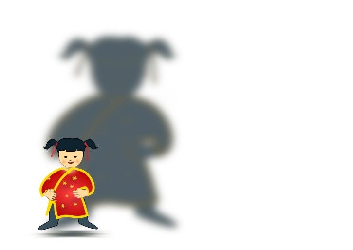

# Connaître les pièges, les éviter, pour partir faire de belles découvertes et s'amuser.

---

# Quel est cet objet ?

# Presenter Notes

Voir les connaissances et vérifiez en même temps l'utilisation :
- Qui en as à la maison ?
- A soi ou à partager ?
- Que font-ils avec ?

---

---

# Un ordinateur

---

---

# Un ordinateur portable

---

---

# Une tablette

---

---

# Un téléphone portable

---

# Que fait-on avec ?

---
# Que fait on avec ?

# Presenter Notes

Passer rapidement

---

# On fait tout ça grâce à quoi ?

---

# Des applications

---

# Mais...

---

# Comment se protéger ?

---

# Installer des applications c'est un peu...

---

# Et vous, d'où vient votre gâteau ?

---

# Et vous, d'où vient votre gâteau ?

---

# Vous ne mangez pas.

---

# Il faut donc installer des applications qui viennent ?

---

# De personnes de confiance

---

# Une 2ième protection

---

# Les antivirus

---

# Conclusions

Pour pouvoir utiliser les applications :

+ On utilise les applications données par des personnes de confiance
+ On utilise un antivirus

---

# Utiliser internet

---

# On va communiquer

---

# Communiquer

---

# Communiquer

---

# Communiquer

---

# Sur internet vous n'êtes pas seul.

---

# D'autres personnes peuvent vous voir.

---

# Et demander à discuter avec vous.

---

# C'est génial, mais...

---

# Vous connaissez l'histoire du petit chaperon rouge ?

---

# En quoi se déguise le loup ?

---

# Ici c'est pareil.

---

# Mais il est...

---

# Comment se protéger

---

# Refuser de discuter

# Presenter Notes

+ Comme dans la rue

---

# Mais si on discute ?

---

# Restez vigilant

---

# Parlez-en !

# Presenter Notes

A vos parents

+ Si la discussion vous gène
+ vous la trouvez bizarre

---

# N'hésitez pas !

# Presenter Notes

+ A vos instituteurs
+ Amis

---

# Échanger sur internet

---

# On échange

---

# Comme vous avez un antivirus

# Presenter Notes

Rappel rapide sur les antivirus

---

# Où les échanger ?

---

# Les endroits sont publics.

---

# C'est comme...

---

# Mettez les dans des lieux privés

---

# En conclusion

---

# On communique, on échange

+ Avec des personnes que l'on connait dans le monde réel.
+ Dans des lieux que l'on sait privé.
+ N'hésitez pas à parler de tout ça

---

# Vous avez aimé ?

---

# Des questions ?

---

# Crédits

Images :

- [Wikimedia](http://commons.wikimedia.org)
- [Open Clip Art Library](http://openclipart.org/)
- [Oxygen Icons](http://www.oxygen-icons.org/)
